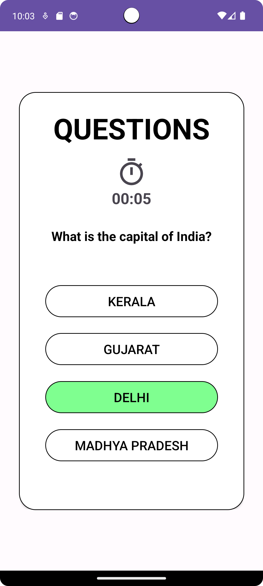
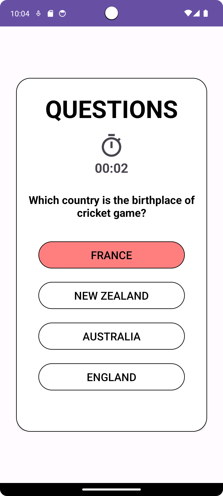
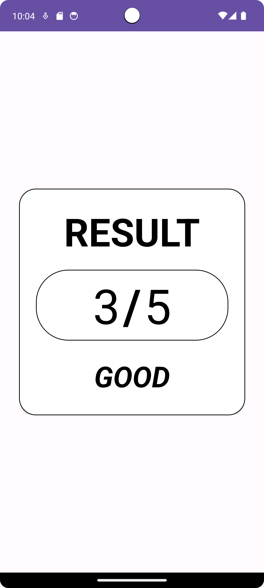

# 🎯 Quiz Master (Android - Kotlin)

## 🌍 Overview

**Quiz Master** is an engaging mobile quiz application built using **Kotlin**. The app presents users with **5 multiple-choice questions (MCQs)**, where they must select the correct option within a **time limit** for each question. At the end of the quiz, the app calculates the **total score** and provides a **personalized message** (Average, Good, Bad, Excellent) based on the performance.

---

## ⭐ Features

### 🎮 Interactive Quiz System
- Users can start a quiz from the **Start Activity**.
- Displays **5 multiple-choice questions** dynamically.
- Time limit per question ensures a challenging experience.
- **Real-time score calculation** after each response.
- Personalized **performance feedback** at the end of the quiz.

### 📊 Quiz Management
- Uses `QuestionModel.kt` to manage question data.
- Supports **customizable question sets**.
- Displays quiz results in **ResultActivity.kt** with feedback.

### 🎨 UI Enhancements
- Modern **Android UI design** with custom backgrounds and animations.
- Dynamic answer selection using XML drawable files.
- **Custom themes** for correct (green) and incorrect (red) answers.

### 🚀 Performance & Optimization
- **Efficient data handling** with Kotlin.
- **Lightweight and fast-loading UI**.
- Optimized **memory management** to prevent app crashes.

---

## 📥 Installation Guide

### Step 1: Clone the Repository
```sh
git clone https://github.com/DarshanScripts/quiz-master.git
```

### Step 2: Open in Android Studio
1. Open **Android Studio**.
2. Select **Open an Existing Project**.
3. Navigate to the project folder and select `quiz-master`.
4. Wait for Gradle sync to complete.

### Step 3: Run the Application
1. Connect an **Android device** or launch an **Emulator**.
2. Click **Run ▶** in Android Studio.
3. The app will launch on your device.

---

## 📂 Project Structure

```
quiz-master/
│── build.gradle                   # Project-level Gradle file
│── settings.gradle                # Gradle module settings
│── gradle.properties              # Gradle configuration
│── gradlew                        # Gradle wrapper (Linux/Mac)
│── gradlew.bat                    # Gradle wrapper (Windows)
│
├── app/                          # Main application module
│   ├── build.gradle               # App-level Gradle file
│   ├── proguard-rules.pro         # ProGuard rules
│   ├── src/
│       ├── main/
│       │   ├── AndroidManifest.xml  # App configuration
│       │   ├── java/com/example/quizmaster/
│       │       ├── MainActivity.kt       # Main quiz logic
│       │       ├── QuestionModel.kt      # Data model for questions
│       │       ├── ResultActivity.kt     # Quiz results screen
│       │       ├── StartActivity.kt      # Start screen
│       │
│       ├── res/                    # UI resources
│           ├── drawable/            # Custom UI elements
│           │   ├── quiz_logo.jpg
│           │   ├── quiz_rounded.png
│           │   ├── right_bg.xml
│           │   ├── wrong_bg.xml
```

---

## Project Screenshots

### Loading Screen


### Start Screen


### Correct Answer Screen


### Incorrect Answer Screen


### Result Screen


---

## 💻 Technologies Used
- **Kotlin** – Primary programming language.
- **Android Jetpack** – Modern Android components.
- **Gradle** – Build automation.
- **XML Drawables** – Custom UI styling.

---

## 👨‍💻 Author
Developed by **Darshan Shah**. Connect with me:

- **LinkedIn**: [Darshan Shah](https://www.linkedin.com/in/darshan-shah-tech/)
- **Facebook**: [DarshanScripts](https://www.facebook.com/DarshanScripts)
- **GitHub**: [DarshanScripts](https://github.com/DarshanScripts)
- **Quora**: [Darshan Shah](https://www.quora.com/profile/Darshan-Shah-1056)
- **Medium**: [DarshanScripts](https://medium.com/@DarshanScripts)
- **Fiverr**: [DarshanScripts](https://www.fiverr.com/darshanscripts)
